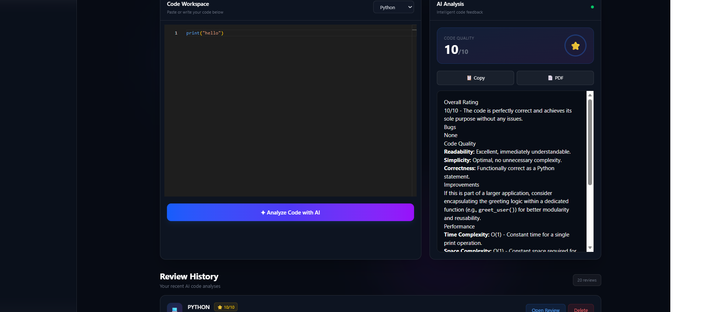
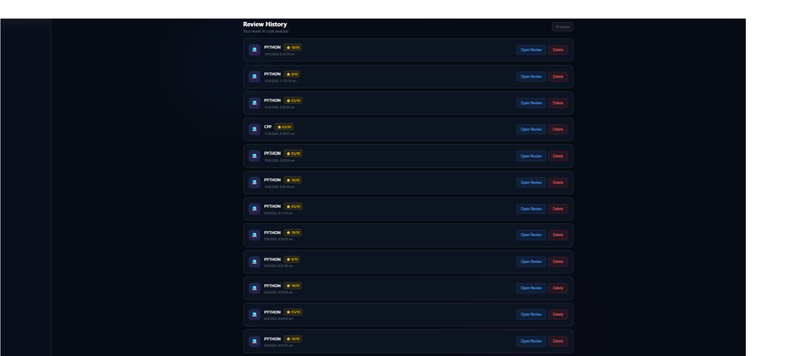

# 🤖 AI Code Review SaaS

An AI-powered Code Review SaaS that analyzes source code and provides intelligent feedback, suggestions, and a code quality score using Google Gemini AI.

## 🚀 Features

- 🤖 AI-powered code review using Google Gemini
- 🔐 User authentication with JWT
- 👤 User-specific review history
- 🗑️ Delete previous reviews
- 📝 Support for multiple programming languages
- 📊 Code quality score
- ⚡ FastAPI backend
- ⚛️ React frontend
- 🗄️ MongoDB database
- 🌙 Premium dark SaaS interface
- 📱 Responsive UI

## 🛠️ Tech Stack

### Frontend
- React
- Vite
- JavaScript
- Tailwind CSS
- Monaco Editor

### Backend
- Python
- FastAPI
- Pydantic
- JWT Authentication

### AI
- Google Gemini API

### Database
- MongoDB
- PyMongo

## 🏗️ Project Structure

```text
ai-code-review-saas/
│
├── app/
│   ├── auth/
│   ├── database/
│   ├── models/
│   ├── routes/
│   ├── services/
│   └── utils/
│
├── frontend/
│   ├── src/
│   ├── public/
│   └── package.json
│
├── screenshots/
│   ├── dashboard.png
│   ├── login.png
│   ├── review.png
│   └── history.png
│
├── main.py
├── requirements.txt
├── package.json
├── .gitignore
└── README.md

### Ab bas 4 commands

README save karne ke baad terminal me **sirf ye commands ek-ek karke**:

Phir uske neeche:

```markdown
## 📸 Screenshots

### 🖥️ Dashboard


### 🔐 Login


### 🤖 AI Code Review


### 📜 Review History


## ✨ Project Highlights

- AI-powered automated code analysis
- Intelligent code quality scoring
- Secure JWT-based authentication
- User-specific review history
- Multiple programming language support
- Modern responsive SaaS interface
- FastAPI REST backend
- React-based frontend
- MongoDB database integration

## 👩‍💻 Author

**Prakriti Jain**

B.Tech AI Student | Python | Full Stack | AI/ML

---

⭐ If you find this project useful, consider giving it a star!